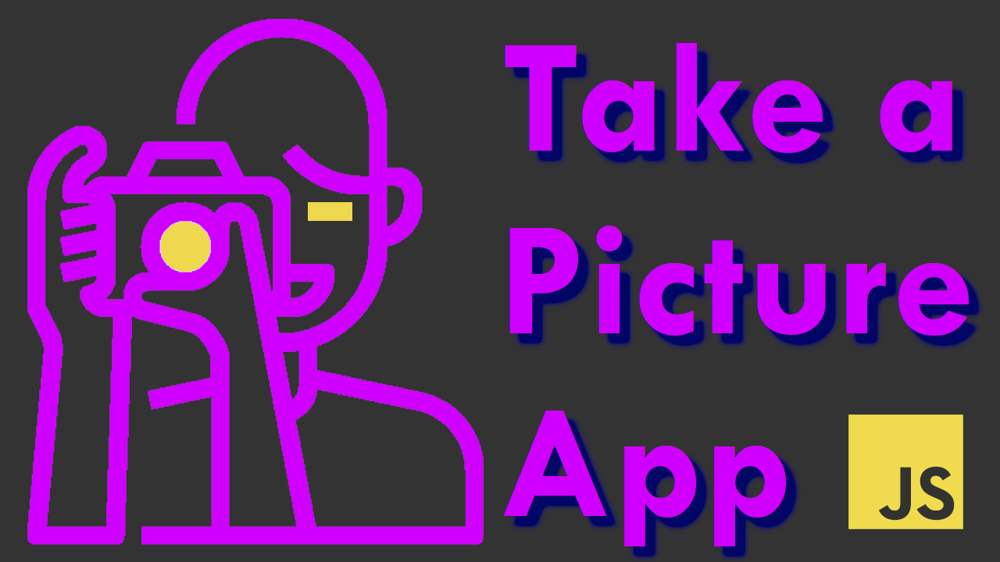

# 📷 JS - Take A Picture App

<!-- ## Background -->

> Super Simple JavaScript app to take a picture from the camera!

### 📚 STACK
- Html
- Css
- Javascript

## Installation

Open index.html in your browser.
Press the K button.

## 🐛 Bugs

...sure

### Video Link
    
[Video Guide](https://youtu.be/Vbj4PtmL0ko)

## License

Usage is provided under the MIT License. See [LICENSE](https://github.com/Yilber/readme-boilerplate/blob/master/LICENSE) for the full details.
